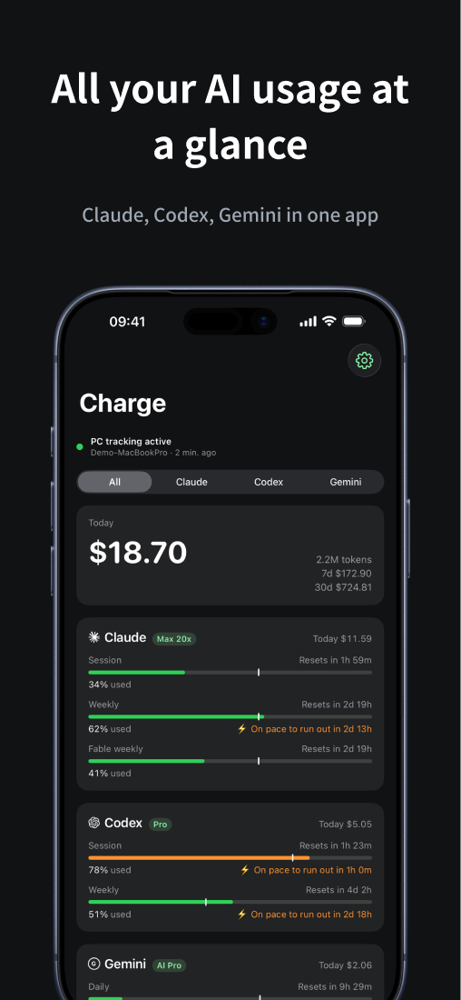
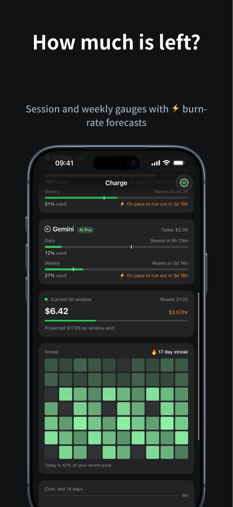
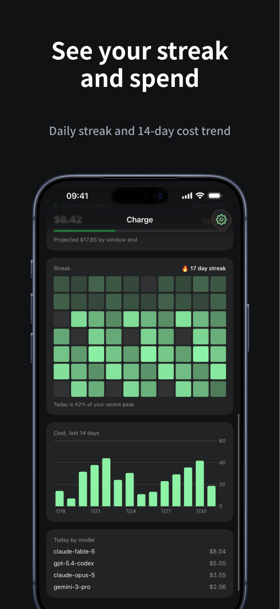
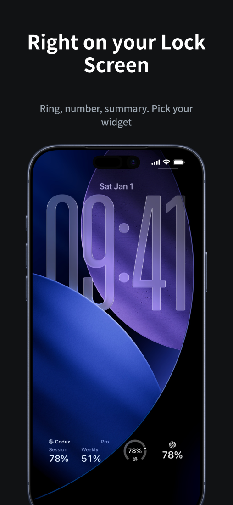
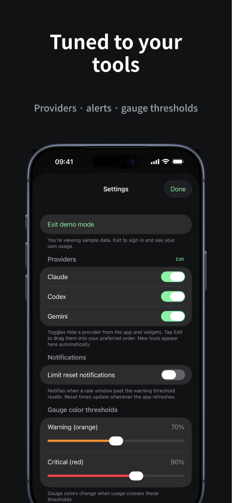
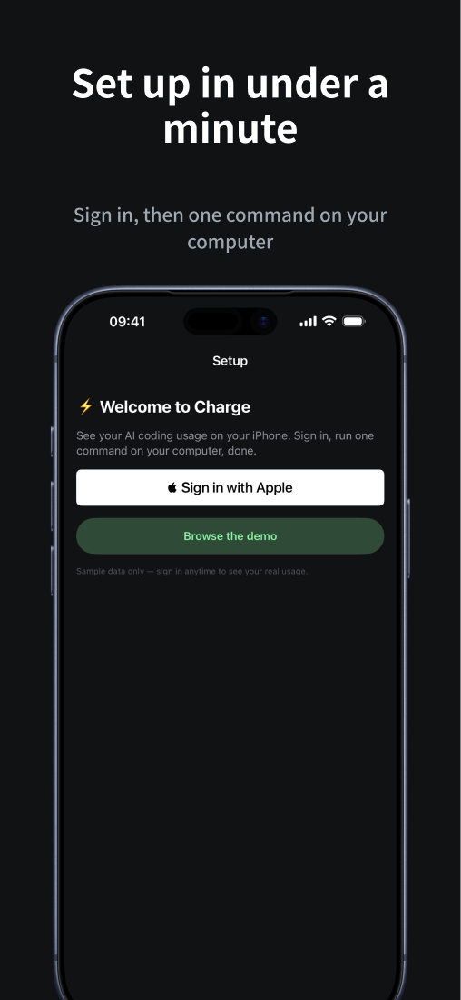
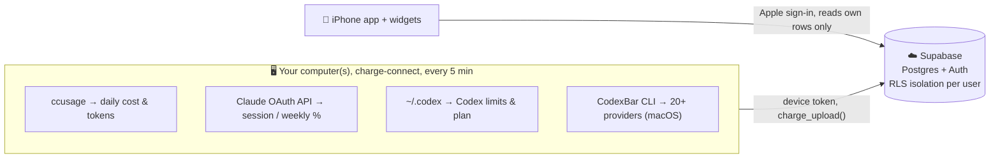

<div align="center">


# ⚡ Charge

### See your AI coding usage on your iPhone.

Session and weekly rate limits, burn-rate prediction, and a cost dashboard for **Claude Code, Codex, and 20+ other providers**, with home- and lock-screen widgets.

[](https://apps.apple.com/app/id6796766465)
[](https://www.npmjs.com/package/charge-connect)
[](#-install-2-minutes)
[](LICENSE)
[](#-contributing)

[**📲 Download on the App Store**](https://apps.apple.com/app/id6796766465) | [Install](#-install-2-minutes) | [How it works](#-how-it-works) | [Privacy](#-privacy--security) | [Roadmap](#-roadmap)

</div>

---

You're deep in a Claude Code session and the questions creep in: *How much of my 5-hour window is left? Am I close to the weekly cap? What have I spent today?* On macOS, menubar apps like [CodexBar](https://github.com/steipete/CodexBar) answer this beautifully. But the moment you step away from your desk, or you're on Windows, you're flying blind.

**Charge** collects usage from your desktop with a tiny background agent and shows it on your **iPhone and widgets**, wherever you are.

> The name is a double meaning: your session limit **drains like a battery**, and your bill **charges up like a tab**. ⚡

<div align="center">
<table>
<tr>
<td></td>
<td></td>
<td></td>
</tr>
<tr>
<td align="center"><sub><b>Everything at a glance</b></sub></td>
<td align="center"><sub><b>Limits + burn-rate</b></sub></td>
<td align="center"><sub><b>Streak &amp; spend</b></sub></td>
</tr>
<tr>
<td></td>
<td></td>
<td></td>
</tr>
<tr>
<td align="center"><sub><b>Lock-screen widgets</b></sub></td>
<td align="center"><sub><b>Tuned to your tools</b></sub></td>
<td align="center"><sub><b>60-second setup</b></sub></td>
</tr>
</table>
</div>

## ✨ Features

- **🔋 Per-provider rate-limit gauges**: Claude and Codex out of the box, plus Gemini, Cursor, Copilot, OpenRouter and more via the macOS [CodexBar](https://github.com/steipete/CodexBar) bridge. Reset countdowns and window-elapsed markers included.
- **⚡ Burn-rate prediction** warns *before* you hit a wall: “at this pace, you'll run out in ~4h.”
- **💸 Cost dashboard**: today / 7-day / 30-day spend and tokens, a daily chart, and a per-model cost ranking.
- **🏷️ Plan badges & account separation**: auto-detects your plan (Max 20x, Education, ...) and splits usage into per-account cards when machines use different logins.
- **🖥️ Connected-computer management**: see which machine last reported and when, get a heads-up when one stops collecting, swipe to unpair.
- **🔔 Reset notifications**: a local iOS notification the moment a window you're watching resets. No server push required, and you can toggle per provider.
- **🟢 Live 5-hour block**: real-time spend, hourly burn ($/h), and a projected window total.
- **🚦 Provider status badges** surface Anthropic / OpenAI status-page incidents.
- **🟩 Streak heatmap**: a GitHub-style 70-day grid (darker = pricier day) with a usage streak 🔥.
- **📱 Widgets**: home-screen gauges plus **5 lock-screen styles** (ring, big number, bar, summary, inline), each with its own provider selection.
- **🌙 Dark theme**: a navy gradient that matches the app icon.

## 📲 Install (2 minutes)

1. Install **Charge** on your iPhone and **Sign in with Apple**.
2. Paste the command the app shows into your computer's terminal:

   ```bash
   npx charge-connect <pairing-code>
   ```

3. That's it. Before consuming the pairing code, the CLI checks for a newer release and asks before updating. It then pairs the device, runs a first collection, and registers an automatic **every-5-minute** sync.

The only requirement is [Node.js](https://nodejs.org) 18+ (macOS, Windows, or Linux). Claude credentials are read automatically: from the Keychain on macOS, `~/.claude/.credentials.json` on Windows/Linux. Optionally `npm i -g ccusage` for faster collection.

On macOS, if [CodexBar](https://github.com/steipete/CodexBar) is installed, Charge automatically picks up whatever extra providers you've enabled there (Claude and Codex keep using Charge's native path, so nothing is double-counted). On Windows, native Claude/Codex collection is supported today; other providers need per-service auth adapters (see the [roadmap](#-roadmap)).

<details>
<summary><b>Want it in the background with no console window? (Windows)</b></summary>

Run the pairing command from an **Administrator PowerShell**, and the collector registers a hidden scheduled task (S4U) so no console flashes every 5 minutes. A normal window still works; it just falls back to an interactive task that briefly appears.

</details>

## 🧭 How it works



The app can only read the signed-in user's own rows, and the collector can only write to its own rows using a device token issued during pairing. Everything is scoped by Postgres **row-level security**.

## 🔌 Supported providers

| Provider | macOS | Windows / Linux | Source |
|---|:---:|:---:|---|
| **Claude** (Claude Code) | ✅ | ✅ | OAuth usage API + `ccusage` |
| **Codex** (ChatGPT) | ✅ | ✅ | live API + `~/.codex` snapshot |
| **Gemini, Copilot, Cursor, OpenRouter, +15 more** | ✅ | ⏳ | [CodexBar](https://github.com/steipete/CodexBar) bridge |

## 🔒 Privacy & security

Charge is built to see as little as possible:

- **No raw identifiers leave your machine.** Account identifiers are hashed before upload, so different accounts stay separate cards without ever storing an email or ID.
- **Row-level security everywhere.** The backend denies by default; every read/write goes through a scoped RPC. The public anon key can't reach anyone else's data.
- **Device tokens, not passwords.** Pairing issues a per-device token (only its hash is stored). `npx charge-connect unpair` revokes it on the server too.
- **Delete everything, anytime.** Account deletion cascades and removes all your data.
- **Open source.** The collector, backend schema, and app are all in this repo, so you can read exactly what's collected.

## 🖥️ Using multiple computers

Pair each machine with its own code (Settings → *Pair another computer*). Daily cost/tokens are stored **per machine and summed by date** in the app: $40 on your MacBook and $10 on your Mac mini shows as $50, and one machine going offline never erases the other's history.

Rate limits and plans are account-level, and every upload carries a **collection timestamp**. The server keeps only the freshest data per account, so an idle machine with an expired login can never overwrite the live gauges reported by the machine you're actually working on.

Claude's usage endpoint is rate limited per Claude account, so computers paired to the same Charge account **take turns** when they are signed in to the same Claude account. In each 5-minute cycle one computer holds a short turn on the backend and asks Claude; the others skip the request and report `shared`, which is not a problem and shows no warning. The computer holding the turn renews it every cycle, and if it sleeps or goes offline another computer takes over in the next cycle. A computer whose Claude Code sign-in has expired, or whose last request failed for a reason other than a rate limit, leaves the turn to another computer. During a rate limit (HTTP `429`) the computer holding the turn keeps it and waits out the limit, so the other computers stay quiet as well. Their `shared` reports do not count as another computer reporting Claude normally, so if the limit lasts, the recovery card for the computer holding the turn still offers to hide Claude instead of pointing to another computer. Computers paired to different Charge accounts do not coordinate, and collectors older than 0.2.0 do not take turns.

If a provider fails, that computer's status line in the app says so. An expired, revoked, or ended Claude Code sign-in is flagged right away, together with the fix (open Claude Code on that computer once, or run `/login` if the sign-in was revoked or Claude Code cleared it after a rejected refresh; collector 0.2.1 tells these apart). Other errors, such as rate limits, show as retrying until they have lasted **at least 20 minutes**, and any problem that lasts that long also gets a card with guidance for that error. Successful collection or a gap longer than 12 minutes starts that period over. The period is measured from the computer's own reports, so leaving the iPhone app open or refreshing it does not lengthen it. This requires the updated app and collector. App 1.0.2 and earlier show a count of consecutive collection attempts instead; with collector 0.2.0 that count also includes cycles in which the collector deliberately sent no request (an expired sign-in, or waiting out a rate limit).

You can hide an unused provider from the recovery card or Settings. This hides its cards, warnings, and reset notifications across the app and widgets, including warnings from other paired computers. Desktop collection and historical cost totals continue. Turn the provider back on in Settings to restore it. Charge does not infer subscription cancellation from a failed request.

### Claude Code doesn't appear

- Open **Claude Code on the computer where Charge is paired**, and check `/status` and `/login`. Signing in to the Claude website or desktop chat alone does not provide the collector with a Claude Code login. API-key accounts do not provide subscription-limit gauges.
- If you use `CLAUDE_CONFIG_DIR` or `CLAUDE_SECURESTORAGE_CONFIG_DIR`, pair Charge from the same environment. Charge saves these location settings locally for scheduled collection and reads the matching credential file or macOS Keychain entry. It does not fall back to a different account's default store.
- A missing or unreadable subscription login now produces setup guidance even before the first usage card exists. An HTTP `401` indicates authentication failure; `403` means access was denied; `429` means the usage request was rate limited. These responses do not establish whether a subscription was cancelled.
- For Windows users running Claude Code inside WSL, pair Charge **inside that WSL environment**, where the Claude credentials and logs are stored.

See [Claude Code authentication](https://code.claude.com/docs/en/authentication). Persistent usage-endpoint `429` responses have also been [reported by Max subscribers](https://github.com/anthropics/claude-code/issues/30930); a review saying “not detected” needs the user's OS, login method, and collector log to identify its specific cause.

## 🛠️ Building from source

```bash
cd ios
xcodegen generate      # requires Xcode 15+ / iOS 17+ / XcodeGen
open Charge.xcodeproj
```

Backend config lives in `ios/Shared/CloudConfig.txt` (line 1 URL, line 2 anon key) and `collector/cloud.json`. Both are gitignored, so run `supabase/schema-v2.sql` on your own Supabase project and fill them in.

> Charge uses an App Group (`group.com.dusan.charge`). When forking, change the bundle and group IDs to your team in `project.yml`.

## ⚙️ Operations

| Task | Command |
|---|---|
| Manual one-off collection | `npx charge-connect run` |
| Collector log (macOS) | `tail -f ~/Library/Logs/charge-connect.log` |
| Collector log (Windows) | `%USERPROFILE%\.charge\collector.log` |
| Collector log (Linux/WSL) | `journalctl --user -u charge-connect` |
| Unregister (macOS) | `launchctl unload ~/Library/LaunchAgents/com.charge.connect.plist` |
| Unregister (Windows) | `Unregister-ScheduledTask -TaskName ChargeConnect` |
| Unregister (Linux/WSL) | `systemctl --user disable --now charge-connect.timer` |
| Unpair (and revoke token) | `npx charge-connect unpair` |
| Update an existing install | `npx charge-connect@latest update` |

### Updating the collector

Collectors from **0.2.0** update themselves. At most once every 12 hours (plus up to an hour of random jitter), after uploading, the scheduled run asks the backend for the latest release manifest and installs it only if all of these checks pass:

- every manifest field has a strict format before anything else is looked at: key id `[a-z0-9]{1,16}`, a plain `x.y.z` version, an npm `sha512-` integrity, and a 64-byte base64 signature;
- the key id is one of the public keys embedded in `collector/updater.js` (unknown ids are rejected), and the Ed25519 signature over `charge-connect-release/v1\n<key_id>\n<version>\n<integrity>\n<tarball>` verifies against that key;
- the tarball URL is exactly `https://registry.npmjs.org/charge-connect/-/charge-connect-<version>.tgz`, the version is strictly newer (no pre-releases), and this computer has not already rolled back the same version and integrity after a failed post-install self-test;
- the download (fetched without following redirects, 2 MB cap) matches the signed `sha512` integrity before anything is unpacked;
- the package contains only regular top-level files (no links, `..`, absolute paths, or subdirectories), is named `charge-connect` with the manifest's version, every `.js` passes `node --check`, and the new `collect.js --self-test` succeeds in the staging directory. The self-test loads every runtime module and prints the version without touching the network, the keychain, or any state file. It runs with a throwaway `--log` file, the way the Windows and Linux schedules start the collector, so a release that breaks while setting up its log is caught too.

The current runtime is backed up to `~/.charge/app.prev/`, and the files in `~/.charge/app` are replaced in place. A rename blocked by a transient Windows lock (`EPERM`, `EBUSY`, `EACCES`) is retried up to 5 times, 200 ms apart, before the swap is rolled back. After the swap the self-test runs again from `~/.charge/app`; if it fails, every file is restored from `~/.charge/app.prev/`. When the self-test process itself exits with an error, that release (version and integrity) is remembered so it is never retried, while a later, higher release still installs. A self-test that times out, is killed, or can't start for a local I/O reason only rolls back, and the same release is tried again in the next window. The new version runs from the next collection. Before the swap starts, an in-progress marker lists the files, the from/to versions, and the updating process. A run that starts while that process is still running (an overlapping schedule or a manual run, within 10 minutes of the marker) skips its collection and leaves the files alone. If the swap is cut off midway (power loss, a killed task), the next run finds the marker, restores `~/.charge/app.prev/` before it loads any other module, logs it, and re-runs itself with the restored `collect.js`. The updater reports success, or remembers a failed post-install self-test, only while the marker is still its own and every installed file matches the staged release; if another run restored the backup in the meantime, the update is rolled back and tried again in the next window. Pairing (`config.json`, `device.json`), collector state files, and the schedule itself (launchd, systemd, Task Scheduler) are left untouched. If a check fails, the log gets one line and the collector tries again in the next window. A run that fails before uploading, including one ended by an uncaught exception or unhandled rejection, still checks for updates before it exits (for at most 3 minutes), so a release with a runtime bug can be repaired by publishing a fixed one.

Collectors **0.1.x** can't update themselves. Run this once on each paired computer:

```bash
npx charge-connect@latest update
```

This copies the new runtime into `~/.charge/app` and keeps your pairing. It re-registers the schedule only where that is safe to repeat unattended: on Linux, and on macOS when no launch agent points at the runtime yet. On Windows it prints the `install.ps1` command instead of re-running it, so a hidden task created from an Administrator PowerShell isn't downgraded. If `~/.charge/app` already holds a newer version (for example after an automatic update), it keeps those files instead of copying an older package over them. Finally, it runs one collection and prints the installed version.

To opt out of automatic updates, add `"auto_update": false` to `~/.charge/config.json`, or set `CHARGE_SKIP_UPDATE=1` in the collector's environment.

### Releasing the collector (maintainers)

1. Deploy the backend first. Apply `supabase/schema-v2.sql` (idempotent; check it locally with `supabase/test-local.sh`) **before** you `npm publish` a collector that relies on it; 0.2.0 is the first. On an older backend a 0.2.0 collector keeps collecting, but the backend stores its `_collector` version key inside `collect_status` (app 1.0.2 then shows a PC with no AI tools as "PC tracking active"), the Claude poll lease (`charge_claim_poll`) is missing so every paired computer fails open and polls Claude on its own instead of taking turns, and there is no release table (with its `key_id` column) to register a manifest in.
2. Bump `collector/package.json`, run `cd collector && npm test`, then `npm publish` from that same checkout.
3. Sign and register the release manifest. The signing key lives only at `~/.charge/release-signing-key.pem` (or pass `CHARGE_SIGNING_KEY` as a PEM path or PEM text); never commit it.

   ```bash
   cd collector
   node scripts/publish-manifest.js <version>           # prints an idempotent SQL upsert to review
   node scripts/publish-manifest.js <version> --apply   # applies it with psql
   node scripts/publish-manifest.js <version> --key-id k2 --apply   # signs with another embedded key id (default k1)
   ```

   The script reads `npm view charge-connect@<version> dist --json` and refuses any tarball URL other than the registry URL above. It then downloads that tarball (without following redirects), recomputes its `sha512` integrity, and compares every file the updater would install with your local `collector/` checkout (`package.json` by value, since npm rewrites its formatting). Any difference, including a file missing on either side, stops the release before the signing key is even read, so a tarball you did not build never gets a signature. Only then does it sign `charge-connect-release/v1\n<key_id>\n<version>\n<integrity>\n<tarball>`, runs the same field format checks the collector runs, and checks the signature against the collector's embedded key for that key id before it prints or applies anything. A key id that is not embedded in `collector/updater.js` is refused up front, and so is one missing from `updater.js` in the previous release on npm (installed collectors only know the keys of the release they run). A previous release without `RELEASE_KEYS` (0.1.x) sets no such limit. The backend must already have `charge_collector_releases` (including `key_id`) and `charge_latest_collector()` from `supabase/schema-v2.sql`. Installed 0.2.0+ collectors pick up the release within about 13 hours.

4. Rotating the signing key: add the new public key under a new id to `RELEASE_KEYS` in `collector/updater.js`, publish that collector signed with the current key, wait until installs have picked it up, then sign later releases with `--key-id <new id>`. The script refuses `--key-id <new id>` for the release that first adds the key.

**Stopping and rolling back a release.** Collectors only read the newest row of `charge_collector_releases`. Deleting a bad release's row is the kill switch: the newest row becomes the previous release, which no updated collector treats as newer, so no further computer installs the bad one. Auto-update never downgrades, so computers that already installed it are repaired by publishing a higher, fixed version (a computer whose post-install self-test failed has already restored `~/.charge/app.prev/` on its own).

## 🗺️ Roadmap

- [x] **Windows collector**: credential-file fallback + `install.ps1` (Task Scheduler)
- [x] **Reset local notifications**: scheduled on-device, no server push
- [x] **Multi-user backend**: Apple sign-in, pairing codes, RLS isolation
- [x] **Multi-machine merge**: per-device rows, summed by date in the app
- [x] **CodexBar provider bridge (macOS)**
- [x] **Freshness-guarded gauges**: stale or signed-out machines can't clobber live data, and the app surfaces per-machine collection health
- [ ] **Phone-only mode**: sign in and read limits without a desktop collector
- [ ] **Threshold push notifications**
- [ ] **Windows adapters** for Gemini, Copilot, OpenRouter, ...

## 🤝 Contributing

Issues and PRs are welcome. The collector has a test suite (`cd collector && npm test`) and CI runs it on real Windows and Linux runners. If you're adding a provider adapter, the CodexBar bridge in `collector/collect.js` is the pattern to follow.

## 🙏 Credits

- [ccusage](https://github.com/ryoppippi/ccusage): local-log cost aggregation
- [CodexBar](https://github.com/steipete/CodexBar) and [Claude Usage Tracker](https://github.com/hamed-elfayome/Claude-Usage-Tracker): big inspiration for the feature set

## 📄 License

[MIT](LICENSE)
