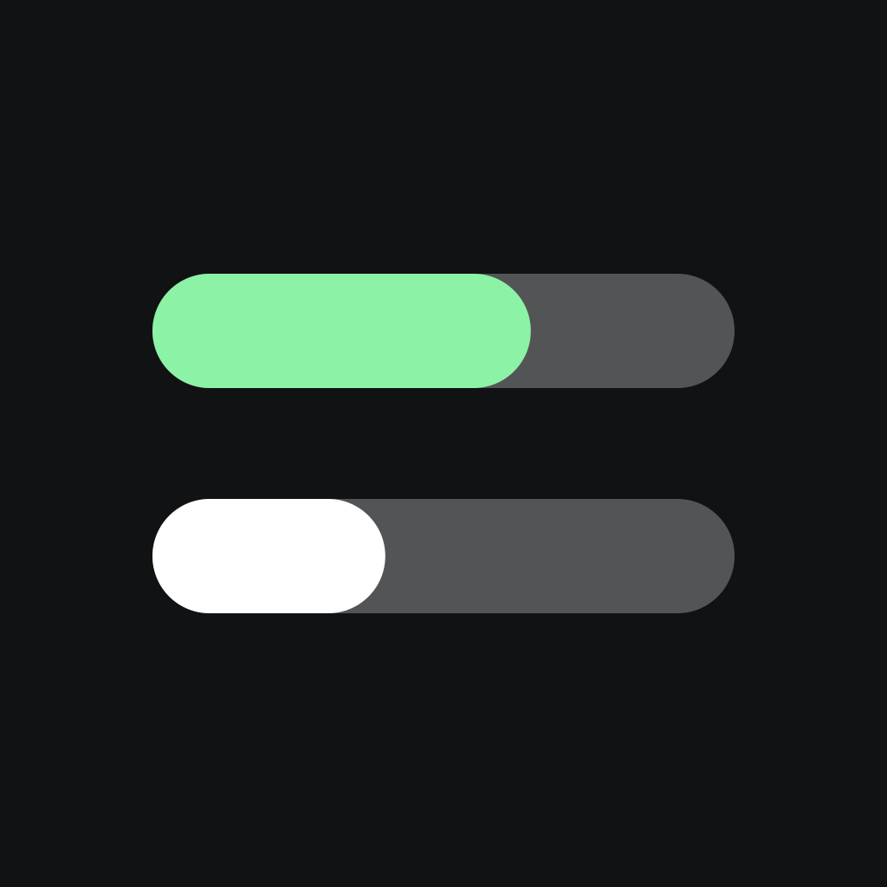

<div align="center">



# ⚡ Charge

### See your AI coding usage on your iPhone.

Session & weekly rate limits, burn‑rate prediction, and a cost dashboard for **Claude Code, Codex, and 20+ other providers** — with home‑ and lock‑screen widgets.

[](https://www.npmjs.com/package/charge-connect)
[](#-install-2-minutes)
[](#-install-2-minutes)
[](LICENSE)
[](#-contributing)

[**📲 App Store**](# "Replace with your App Store link") · [Install](#-install-2-minutes) · [How it works](#-how-it-works) · [Privacy](#-privacy--security) · [Roadmap](#-roadmap)

</div>

---

You're deep in a Claude Code session and the questions creep in: *How much of my 5‑hour window is left? Am I close to the weekly cap? What have I spent today?* On macOS, menubar apps like [CodexBar](https://github.com/steipete/CodexBar) answer this beautifully — but the moment you step away from your desk, or you're on Windows, you're flying blind.

**Charge** collects usage from your desktop with a tiny background agent and shows it on your **iPhone and widgets** — wherever you are.

> The name is a double meaning: your session limit **drains like a battery**, and your bill **charges up like a tab**. ⚡

## ✨ Features

- **🔋 Per‑provider rate‑limit gauges** — Claude and Codex out of the box, plus Gemini, Cursor, Copilot, OpenRouter and more via the macOS [CodexBar](https://github.com/steipete/CodexBar) bridge. Reset countdowns and window‑elapsed markers included.
- **⚡ Burn‑rate prediction** — warns *before* you hit a wall: “at this pace, you'll run out in ~4h.”
- **💸 Cost dashboard** — today / 7‑day / 30‑day spend and tokens, a daily chart, and a per‑model cost ranking.
- **🏷️ Plan badges & account separation** — auto‑detects your plan (Max 20x, Education, …) and splits usage into per‑account cards when machines use different logins.
- **🖥️ Connected‑computer management** — see which machine last reported and when; swipe to unpair.
- **🔔 Reset notifications** — a local iOS notification the moment a window you're watching resets. No server push required; toggle per provider.
- **🟢 Live 5‑hour block** — real‑time spend, hourly burn ($/h), and a projected window total.
- **🚦 Provider status badges** — surfaces Anthropic / OpenAI status‑page incidents.
- **🟩 Streak heatmap** — a GitHub‑style 70‑day grid (darker = pricier day) with a usage streak 🔥.
- **📱 Widgets** — home‑screen gauges plus **5 lock‑screen styles** (ring, big number, bar, summary, inline), each with its own provider selection.
- **🌙 Dark theme** — a navy gradient that matches the app icon.

## 📲 Install (2 minutes)

1. Install **Charge** on your iPhone and **Sign in with Apple**.
2. Paste the command the app shows into your computer's terminal:

   ```bash
   npx charge-connect <pairing-code>
   ```

3. That's it. This pairs the device, runs a first collection, and registers an automatic **every‑5‑minute** sync.

The only requirement is [Node.js](https://nodejs.org) 18+ (macOS, Windows, or Linux). Claude credentials are read automatically — from the Keychain on macOS, `~/.claude/.credentials.json` on Windows/Linux. Optionally `npm i -g ccusage` for faster collection.

On macOS, if [CodexBar](https://github.com/steipete/CodexBar) is installed, Charge automatically picks up whatever extra providers you've enabled there (Claude and Codex keep using Charge's native path, so nothing is double‑counted). On Windows, native Claude/Codex collection is supported today; other providers need per‑service auth adapters (see the [roadmap](#-roadmap)).

<details>
<summary><b>Want it in the background with no console window? (Windows)</b></summary>

Run the pairing command from an **Administrator PowerShell** — the collector then registers a hidden scheduled task (S4U) and no console flashes every 5 minutes. A normal window still works; it just falls back to an interactive task that briefly appears.

</details>

## 🧭 How it works


The app can only read the signed‑in user's own rows, and the collector can only write to its own rows using a device token issued during pairing. Everything is scoped by Postgres **row‑level security**.

## 🔌 Supported providers

| Provider | macOS | Windows / Linux | Source |
|---|:---:|:---:|---|
| **Claude** (Claude Code) | ✅ | ✅ | OAuth usage API + `ccusage` |
| **Codex** (ChatGPT) | ✅ | ✅ | live API + `~/.codex` snapshot |
| **Gemini, Copilot, Cursor, OpenRouter, +15 more** | ✅ | ⏳ | [CodexBar](https://github.com/steipete/CodexBar) bridge |

## 🔒 Privacy & security

Charge is built to see as little as possible:

- **No raw identifiers leave your machine.** Account identifiers are hashed before upload, so different accounts stay separate cards without ever storing an email or ID.
- **Row‑level security everywhere.** The backend denies by default; every read/write goes through a scoped RPC. The public anon key can't reach anyone else's data.
- **Device tokens, not passwords.** Pairing issues a per‑device token (only its hash is stored). `npx charge-connect unpair` revokes it on the server too.
- **Delete everything, anytime.** Account deletion cascades and removes all your data.
- **Open source.** The collector, backend schema, and app are all in this repo — read exactly what's collected.

## 🖥️ Using multiple computers

Pair each machine with its own code (Settings → *Pair another computer*). Daily cost/tokens are stored **per machine and summed by date** in the app — $40 on your MacBook and $10 on your Mac mini shows as $50, and one machine going offline never erases the other's history. Rate limits and plans are account‑level, so they're always up to date no matter which machine reports.

## 🛠️ Building from source

```bash
cd ios
xcodegen generate      # requires Xcode 15+ / iOS 17+ / XcodeGen
open Charge.xcodeproj
```

Backend config lives in `ios/Shared/CloudConfig.txt` (line 1 URL, line 2 anon key) and `collector/cloud.json`. Both are gitignored — run `supabase/schema-v2.sql` on your own Supabase project and fill them in.

> Charge uses an App Group (`group.com.dusan.charge`). When forking, change the bundle and group IDs to your team in `project.yml`.

## ⚙️ Operations

| Task | Command |
|---|---|
| Manual one‑off collection | `npx charge-connect run` |
| Collector log (macOS) | `tail -f ~/Library/Logs/charge-connect.log` |
| Collector log (Windows) | `%USERPROFILE%\.charge\collector.log` |
| Collector log (Linux/WSL) | `journalctl --user -u charge-connect` |
| Unregister (macOS) | `launchctl unload ~/Library/LaunchAgents/com.charge.connect.plist` |
| Unregister (Windows) | `Unregister-ScheduledTask -TaskName ChargeConnect` |
| Unregister (Linux/WSL) | `systemctl --user disable --now charge-connect.timer` |
| Unpair (and revoke token) | `npx charge-connect unpair` |

## 🗺️ Roadmap

- [x] **Windows collector** — credential‑file fallback + `install.ps1` (Task Scheduler)
- [x] **Reset local notifications** — scheduled on‑device, no server push
- [x] **Multi‑user backend** — Apple sign‑in, pairing codes, RLS isolation
- [x] **Multi‑machine merge** — per‑device rows, summed by date in the app
- [x] **CodexBar provider bridge (macOS)**
- [ ] **Phone‑only mode** — sign in and read limits without a desktop collector
- [ ] **Threshold push notifications**
- [ ] **Windows adapters** for Gemini, Copilot, OpenRouter, …

## 🤝 Contributing

Issues and PRs are welcome. The collector has a test suite (`cd collector && npm test`) and CI runs it on real Windows and Linux runners. If you're adding a provider adapter, the CodexBar bridge in `collector/collect.js` is the pattern to follow.

## 🙏 Credits

- [ccusage](https://github.com/ryoppippi/ccusage) — local‑log cost aggregation
- [CodexBar](https://github.com/steipete/CodexBar) and [Claude Usage Tracker](https://github.com/hamed-elfayome/Claude-Usage-Tracker) — big inspiration for the feature set

## 📄 License

[MIT](LICENSE)
